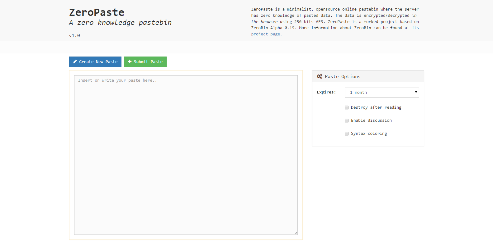
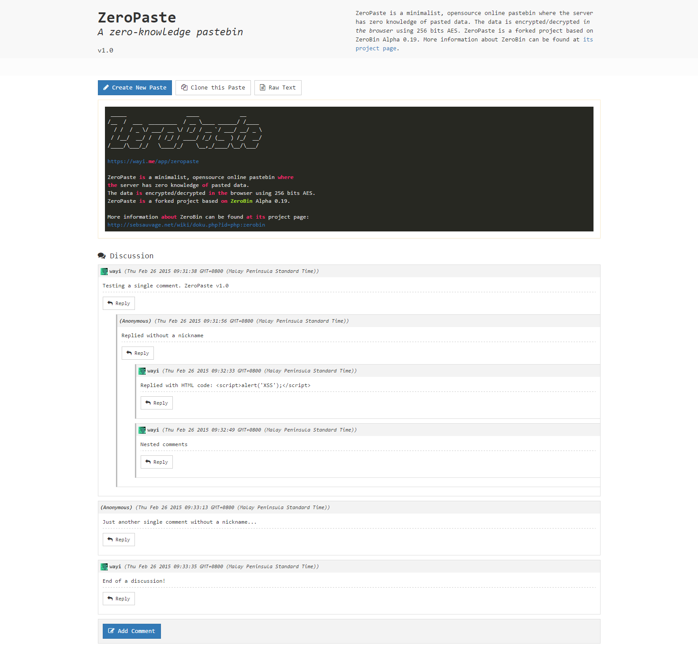

#Dockerized variant
Start container with "docker-compose up" or with docker command:
```bash
docker run -e "PRIMARYCOLOR=green" -e "ACCENTCOLOR=red darken-1" -e "TEXTCOLOR=white" -e "BACKGROUNDCOLOR=white" -e "ALWAYSSYNTAX=1" -p "81:80" jimtim/zeropaste
```

# ZeroPaste v1

ZeroPaste is a minimalist, open source online pastebin where the server
has zero knowledge of pasted data. The data is encrypted/decrypted in
the browser using 256 bits AES.

**URL:** https://wayi.me/app/zeropaste

>ZeroPaste is a forked project based on ZeroBin Alpha 0.19. More information about ZeroBin can be found at its project page:
http://sebsauvage.net/wiki/doku.php?id=php:zerobin

## Requirements

* **Server**
  - PHP 5.2.6 and above
  - GD library
  - No database required
* **Client**
  - A modern, javascript-capable web browser

## Install

1. Upload all files to your web server, e.g. `/www/ZeroPaste/`
2. Done!

## Screenshot



_**Screenshot 01:** Create/submit a new paste_



_**Screenshot 02:** Submitted paste with discussion enabled_

## License

Copyright (c) 2015 Heiswayi Nrird

This software is provided 'as-is', without any express or implied warranty.
In no event will the authors be held liable for any damages arising from
the use of this software.

Permission is granted to anyone to use this software for any purpose,
including commercial applications, and to alter it and redistribute it
freely, subject to the following restrictions:

    1. The origin of this software must not be misrepresented; you must
       not claim that you wrote the original software. If you use this
       software in a product, an acknowledgment in the product documentation
       would be appreciated but is not required.

    2. Altered source versions must be plainly marked as such, and must
       not be misrepresented as being the original software.

    3. This notice may not be removed or altered from any source distribution.
